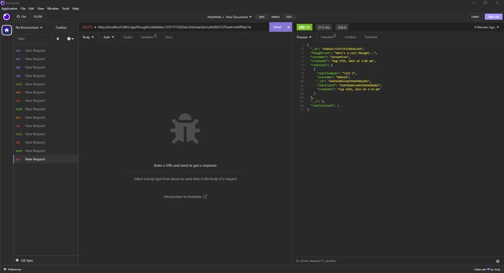

# Social Network API

## Description
This project harnesses the power of Node.js, Express, MongoDB, Mongoose, and Validator to showcase the implementation of fundamental CRUD (Create, Read, Update, Delete) operations.The project demonstrates a practical utilization of these technologies in crafting the backbone of a social networking platform, offering an opportunity to understand a dynamic and interactive web application. Delve into the code to witness the harmony of these tools and gain insights into the mechanics of constructing a functional and efficient back end for a virtual community hub.

## Table of Contents
  * [Installation](#installation)
  * [Usage](#usage)
  * [License](#license)
  * [Contribute](#contributions)
  * [Tests](#tests)
  * [Questions?](#questions)

## Installation
Once the repository is cloned, from the root directory of where you installed the application you will run the command 'npm install' to install required dependencies. You must be sure to have downloaded and installed MongoDB. After the dependancies are loaded, and MongoDB is installed on your computer, you must simply run the command 'node server.js' to run the program.

## Usage
Click on the link below to see how to use the app on <a href="https://www.youtube.com/watch?v=i1SNlmUo0vU" target="_blank">YouTube</a>.

## License

## Contribute
Please feel free to contact me on my email or my github to contribute.

## Tests
No tests available at this time.

## Questions
Please reach out to me at derekmarchese1@gmail.com. 
Or check out my <a href="https://github.com/dtm589">GitHub</a>.